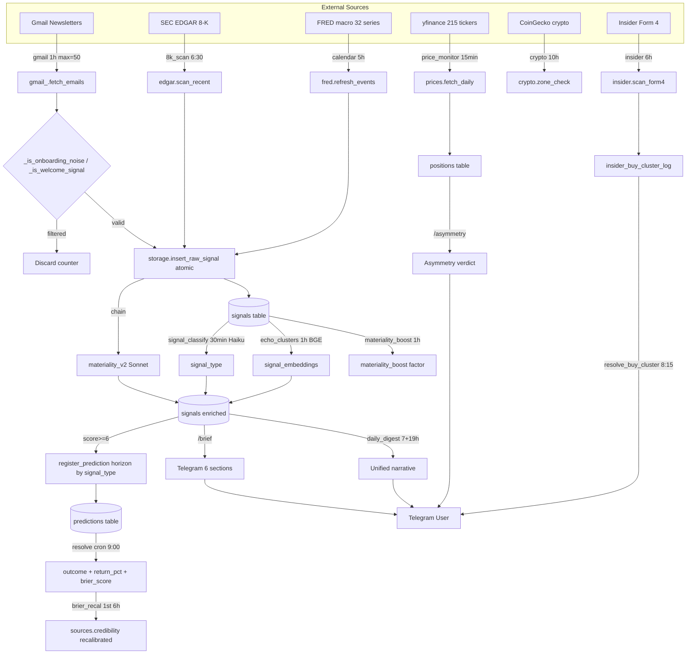
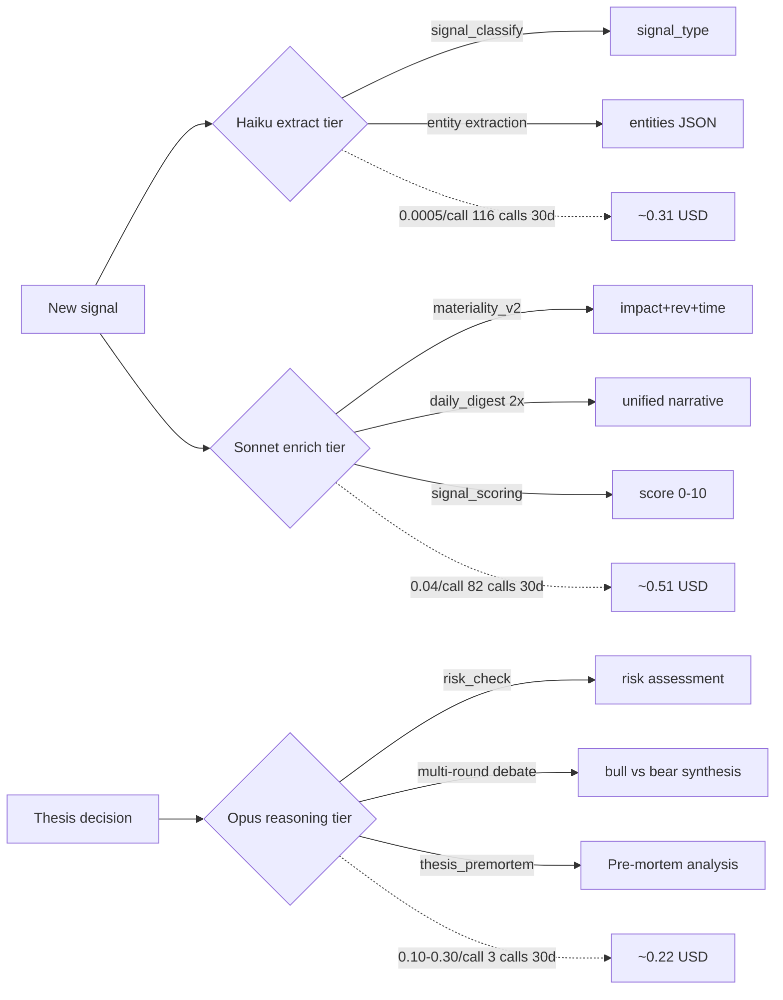

# Data Lineage - mes-bots-finance

**Updated**: 13 May 2026

Visual flow from raw inputs to user-facing restitution. Mermaid renders natively in GitHub markdown.

## Main pipeline (Gmail-centric)



## Monitoring and meta crons

```mermaid
flowchart LR
    DB[(SQLite WAL)] -->|backup 4:00 daily| BAK[scripts/backup.sh + 14d rotation]
    LC[(llm_calls)] -->|weekly Sun 22:00| COST[/cost_trajectory MTD + projection + budget]
    P[(predictions)] -->|weekly Sun 22:30| KPI[/kpi_status 5 KPIs]
    D[(decisions)] -->|weekly Sun 22:30| KPI
    HC[(handler_calls)] -->|weekly Sun 23:00| HS[/handler_stats Pareto]

    BAK --> FS[~/backups/mes-bots-finance/]
    COST --> TG[Telegram notify]
    KPI --> TG
    HS --> TG
```

## LLM cascade flow



## Key invariants

- All math-critical operations have property-based tests in tests/ (49 tests Hypothesis)
- All ingestion paths use atomic INSERT+UPDATE pattern with last_signal_at propagation
- Chained materiality_v2 ensures 100% rubric coverage post-ingest
- Backup runs daily 04:00 Paris with integrity_check enforced
- WAL mode allows concurrent reads during writes
- 4 weekly Sunday summaries: cost 22:00, kpi 22:30, handler_stats 23:00, monthly recal 1st 6:00
